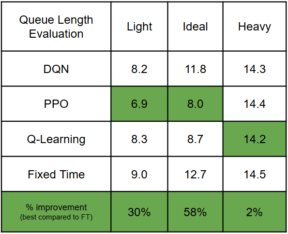

# Adaptive Traffic Light using RL Algorithms

## Overview

This project implements an adaptive traffic light control system using Reinforcement Learning (RL) algorithms, specifically PPO, DQN, and Q-Learning, compared against a baseline Fixed Time control strategy. The simulation focuses on controlling a single traffic light (ID: 41896158) in a traffic intersection using SUMO (Simulation of Urban MObility) integrated with RL frameworks.

Key elements:
- **Algorithms Used**: PPO, DQN, Q-Learning (compared to Fixed Time baseline).
- **Demand Levels**:
  - **Light**: Only cars going straight through the intersection.
  - **Ideal**: Includes cars, buses, pedestrians, and turns at the intersection.
  - **Heavy**: Simulates traffic jams.
- **Evaluation Metrics**: Average queue length and cumulative reward. PPO has shown the best performance based on these metrics.
- **Simulation Tool**: SUMO, interfaced with Python via TraCI and integrated with Gym for RL.

The goal is to optimize traffic flow by dynamically adjusting traffic light phases based on real-time demand, using a custom SUMO environment with PPO and DQN implementations from Stable Baselines3.

## Requirements

To replicate this project, you'll need Python 3.8+ and SUMO installed on your system. SUMO is essential for running the traffic simulations. Several Python packages are required for RL algorithms, data processing, and visualization.

### Installing SUMO
1. Download and install SUMO from the official website: [Eclipse SUMO](https://www.eclipse.org/sumo/).

### Python Packages
Install the required Python packages using pip. It's recommended to create a virtual environment first (e.g., using `venv` or `conda`).

Run the following command:
```
pip install sumo-rl gymnasium stable-baselines3 torch numpy pandas matplotlib scipy
```

- **sumo-rl**: Integrates SUMO with RL environments (Gym-compatible).
- **gymnasium**: Provides the Gym interface for creating RL environments.
- **stable-baselines3**: Implements PPO and DQN algorithms (Q-Learning can be custom or via other libraries).
- **torch**: Backend for deep learning in Stable Baselines3.
- **numpy, pandas, matplotlib, scipy**: For data handling, analysis, and plotting results.

Ensure compatibility with Python 3.8+. No additional packages can be installed via the internet during simulation—use only the listed packages.

## Project Structure

- **rl_algorithms/**: Contains scripts for RL algorithms (e.g., `PPO_working.py`, `DQN_working.py`, etc.) to train and test models.
- **stats/**: Includes `test_best_model_working.py` for generating combined graphs of performance metrics.
- **random_trip_generator/**: Contains `randomTrips2.py` for generating random trip files.
- **network/**: Holds the network file `final_network.net.xml` used for the simulation.
- **config/**: Configuration files (e.g., `ideal.sumocfg`) and route demand files for varying demand levels (random, light, ideal, heavy).
- **additional/**: Additional simulation elements like bus stops and traffic lights.

## How to Replicate

Follow these steps to set up, run the simulations, and analyze results.

### 1. Clone the Repository
```
git clone https://github.com/iamtheazizul/RL-Traffic.git
cd RL-Traffic
```

### 2. Prepare the Environment
- Ensure SUMO is installed and configured as described in Requirements.
- Install Python packages as listed above.
- The simulation uses `final_network.net.xml` from the `network/` folder as the base road network.
- Demand elements (routes for vehicles, pedestrians, etc.) are in the `config/` folder, including configuration files (e.g., `ideal.sumocfg`) and route files for different demand levels:
  - Random: General random traffic.
  - Light: Straight-through cars only.
  - Ideal: Mixed traffic with turns, buses, and pedestrians.
  - Heavy: High-density traffic simulating jams.
- Additional elements (e.g., bus stops, traffic light definitions) are in the `additional/` folder.

### 3. Generate Random Trips (Optional)
To generate custom random trip files for varying demands:
- Navigate to `random_trip_generator/`.
- Run `randomTrips2.py` with appropriate parameters:
  ```
  python randomTrips2.py -n ../network/final_network.net.xml -o trips.xml --period 1 --fringe-factor 5
  ```
- This generates `trips.xml` for use in config/route files. Adjust `--period` for demand density (lower period = higher demand).

### 4. Run the RL Algorithms
- Navigate to the `rl_algorithms/` folder.
- Run the PPO or DQN scripts to train models. Example for PPO:
  ```
  python PPO_working.py
  ```
- For DQN, use:
  ```
  python DQN_working.py
  ```
- Replace `--demand` with the appropriate route file for light, ideal, heavy, or random demands.
- The scripts train models to control the traffic light (ID: 41896158), saving data (models, logs, rewards) in `.npy` files (e.g., `ppo_reward_history.npy`).
- Compare against the baseline by running the fixed-time script (e.g., `fixed_time_baseline.py`).
- Training parameters (e.g., learning rate, episodes) are set in the scripts:
  - PPO: 250 episodes, learning rate 0.0003, 1800 steps/episode.
  - DQN: 150 episodes, learning rate 0.0001, 1800 steps/episode.
- Training may take time depending on hardware. Monitor metrics like average queue length and cumulative rewards.

### 5. Analyze and Visualize Results
- After training all the algorithms, navigate to the `stats/` folder.
- Run the visualization script to generate combined graphs (e.g., queue lengths, rewards) for PPO, DQN, Q-Learning, and Fixed Time baseline:
  ```
  python test_best_model_working.py
  ```
- This produces plots comparing performance across algorithms and demand levels, saved as images (e.g., `training_evaluation_metrics_ppo.png`).

## Results

Experiments show:
- PPO outperforms DQN, Q-Learning, and Fixed Time in average queue length and cumulative reward across demand levels.
- Visualizations highlight improvements in traffic flow with adaptive control across varying demand levels.

Sample result images:



